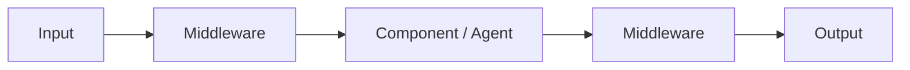

# Middleware — Overview

## What is middleware?

Middleware is a controlled point in an execution flow where we can inspect, modify, or influence processing.

## Conceptual flow

## Why is it useful?

It can provide a reusable place for cross-cutting behavior without placing that behavior directly inside every component.

## Related

- [Custom Middleware](custom.md)
- [Predefined Middleware](predefined.md)

!!! tip "Sticky note"
    Middleware gives us a controlled point where we can inspect or modify execution.
