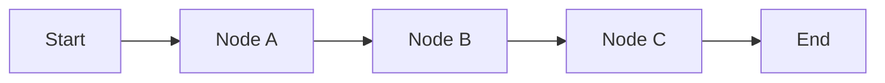

# LangGraph — Introduction

LangGraph is a framework for building graph-based application flows.

## Conceptual model

This demo intentionally keeps the explanation simple. The real learning material will be added later.
