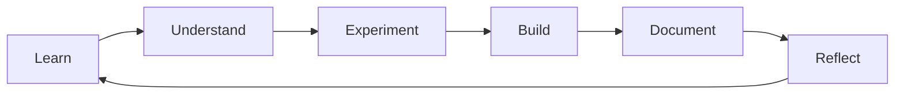

# Dhyey's Learning Lab

## Learning → Understanding → Building → Documenting

A personal engineering learning laboratory where I document what I learn about **Agentic AI, LangChain, LangGraph, Transformers, Machine Learning, RAG, and AI Engineering**.

---

## :material-radar: Currently Learning

### Agentic AI → Frameworks → LangChain → Middleware

I'm currently exploring how middleware fits into the execution flow of AI applications and how it can be used to control, inspect, or modify execution.

**Explore:**

- [LangChain Introduction](frameworks/langchain/introduction.md)
- [Middleware](frameworks/langchain/middleware/overview.md)

---

## :material-map-marker-path: Learning Paths

<div class="grid cards" markdown>

-   :material-robot-outline:{ .lg .middle } **Agentic AI**

    ---

    Concepts, architectures, execution flows, and experiments behind AI agents.

    [:octicons-arrow-right-24: Explore Agentic AI](agentic-ai/index.md)

-   :material-link-variant:{ .lg .middle } **LangChain**

    ---

    Learning LangChain from fundamentals through practical examples.

    [:octicons-arrow-right-24: Explore LangChain](frameworks/langchain/introduction.md)

-   :material-graph-outline:{ .lg .middle } **LangGraph**

    ---

    Understanding graph-based application flows and stateful execution.

    [:octicons-arrow-right-24: Explore LangGraph](frameworks/langgraph/introduction.md)

-   :material-brain:{ .lg .middle } **Transformers & RAG**

    ---

    Attention mechanisms, embeddings, retrieval-augmented generation — coming as I work through them.

    [:octicons-arrow-right-24: Coming soon](agentic-ai/index.md)

</div>

---

## :material-brain: How I Learn



The goal isn't simply to collect notes.

The goal is to:

**Understand → Experiment → Build → Explain**

---

## :material-notebook-edit-outline: Recent Learning

### Middleware

Understanding where middleware sits in an execution pipeline.

[Read Middleware →](frameworks/langchain/middleware/overview.md)

### Custom Middleware

A small Python example demonstrating the basic idea.

[Read Custom Middleware →](frameworks/langchain/middleware/custom.md)

### LangGraph

A first look at graph-based application flows.

[Read LangGraph →](frameworks/langgraph/introduction.md)

---

## :material-pin: Learning Notes

!!! note "My takeaway"

    **Middleware gives us a controlled point where we can inspect or modify execution.**

The important part of documenting a concept is capturing **what I understood**, not just reproducing framework documentation.

---

## :material-flask-outline: Experiments

My learning repository will eventually contain runnable Python examples alongside the explanations.

```text
Documentation
     ↓
Concept
     ↓
Example
     ↓
Experiment
     ↓
Result
     ↓
My Understanding
```

[Explore Examples →](examples/index.md)

---

## :material-palette-outline: Visualizations

Architecture diagrams and execution flows help turn abstract AI concepts into something easier to reason about.

[Explore Visualizations →](visualizations/index.md)

---

## :material-pencil-outline: Handwritten Notes

My handwritten study notes will live alongside the digital documentation.

[Explore Handwritten Notes →](handwritten-notes/index.md)

---

## :material-link-variant: References & Discussions

Supporting resources and questions will remain connected to the relevant learning topics rather than cluttering the main navigation.

* [References →](references/index.md)
* [Discussions →](discussions/index.md)

---

## :material-source-branch: GitHub → Netlify

The **GitHub repository is the single source of truth**.

The website is generated from the repository and automatically deployed through Netlify.

```text
Learn
  ↓
Document
  ↓
Git commit
  ↓
Git push
  ↓
MkDocs build
  ↓
Netlify
  ↓
🌐 Learning Lab
```

---

!!! tip "The principle behind this website"

    > **Where does this concept belong in my learning hierarchy?**

    Once that is clear, I should be able to add the content to GitHub and let the website evolve with my learning journey.
