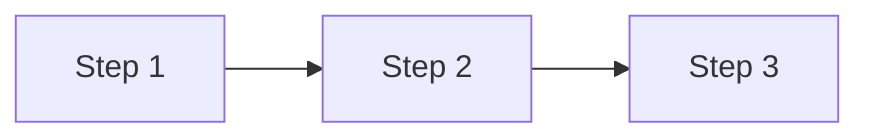

---
tags:
  - TODO-add-tags-here
---

# Topic Title

## :material-help-circle-outline: Concept

What is this, in plain language?

## :material-lightbulb-on-outline: Why It Matters

Why does this exist? What problem does it solve?

## :material-thought-bubble-outline: Mental Model

The simplest analogy or way to think about this.

## :material-chart-timeline-variant: Diagram



## :material-code-tags: Example

```python
# minimal working example
```

## :material-account-check-outline: My Understanding

!!! note "My takeaway"

    Write this in your own words — this is the part that actually matters.

## :material-alert-circle-outline: Common Mistakes

!!! warning "Watch out for"

    - Mistake 1
    - Mistake 2

## :material-link-variant: Related Topics

- [Related Topic →](#)

## :material-book-open-variant: References

- [Source →](#)

## :material-source-branch: Implementation

Link to the actual code in this repo, if applicable.

- [View on GitHub →](#)
